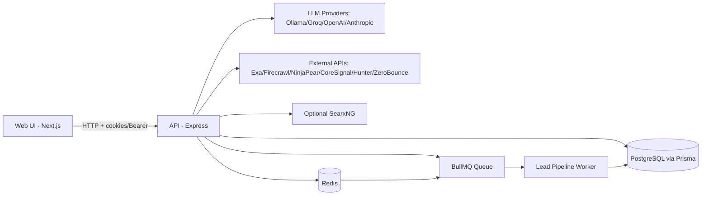

# i2e Marketing Hub
**Type:** Internal Tool / Accelerator Platform  
**Domain:** Marketing Operations, AI-assisted Content and Lead Generation  
**Status:** MVP (Active Development)  
**Owner:** i2e Consulting - AI Labs  
**Last Updated:** 2026-03-30

## What It Does
i2e Marketing Hub is a monorepo platform that combines authenticated workflow APIs and a Next.js dashboard to run two major AI workflows: (1) content generation and approval pipelines, and (2) ContextLead AI campaign execution for lead discovery, verification, scoring, and export. It provides team-scoped access control, draft/version lifecycle management, queue-backed execution for lead pipelines, and a UI for campaign operations, run tracking, results, evidence review, and user administration.

## Why It Exists
Before this system, marketing and growth workflows were fragmented across manual docs, ad-hoc prompts, and disconnected tools for research, validation, and campaign output. This platform centralizes those processes into consistent API-driven pipelines with structured approvals, auditable run data, and reusable operational surfaces for both engineering and operations teams.

---

## Table of Contents

1. [What Every README Must Cover](#1-what-every-readme-must-cover)
2. [Project Identity Block](#2-project-identity-block)
3. [Key Features](#3-key-features)
4. [Architecture Overview](#4-architecture-overview)
5. [Technology Stack](#5-technology-stack)
6. [Project Structure](#6-project-structure)
7. [Environment & Data Requirements](#7-environment--data-requirements)
8. [How to Run](#8-how-to-run)
9. [Processing Pipeline](#9-processing-pipeline)
10. [API Reference](#10-api-reference)
11. [Example Usage](#11-example-usage)
12. [Frontend Structure](#12-frontend-structure)
13. [Deployment](#13-deployment)
14. [Security Considerations](#14-security-considerations)
15. [Performance Considerations](#15-performance-considerations)
16. [Implemented vs. Not Implemented](#16-implemented-vs-not-implemented)
17. [Known Issues & Failure Modes](#17-known-issues--failure-modes)
18. [Future Scope](#18-future-scope)
19. [Coding Hygiene Standards](#19-coding-hygiene-standards)
20. [Contribution Protocol](#20-contribution-protocol)
21. [License](#21-license)
22. [Maintainers](#22-maintainers)
23. [Full README Template](#23-full-readme-template)

---

## 1. What Every README Must Cover

This README intentionally covers:
- What the system does and why it exists.
- Architecture, data flow, and component responsibilities.
- Local/dev/prod run paths with exact commands.
- Environment variables and external service dependencies.
- API surface with key request/response examples.
- Feature status (implemented, partial, missing), known failures, and future scope.

---

## 2. Project Identity Block

Identity block is defined at the top of this file and must be kept current in all major release PRs.

**Rules for this repo:**
- Keep `Status` honest (currently MVP).
- Update `Last Updated` on any architecture or runbook change.
- Keep `What It Does` and `Why It Exists` aligned with actual implemented workflows.

---

## 3. Key Features

- Team-scoped authentication with role-aware access (`ADMIN`, `MEMBER`, `REVIEWER`)
- Content draft/version lifecycle with approval workflow (`BRAND`, `LEGAL`, `MANAGER`)
- Content generation pipeline with memory retrieval, research, extraction, writing, and guardrails
- Queue-backed lead generation pipeline with multi-layer orchestration and telemetry
- Lead campaign run tracking with SSE status streaming
- Lead result export to CSV
- Credit ledger and team balance controls for lead pipeline usage
- Next.js operations UI for dashboard, campaigns, runs, results, evidence, and user management
- Dockerized local development stack with Postgres, API, Web, Redis, optional SearxNG

---

## 4. Architecture Overview

## Architecture



### Component Map

| Component | Role | Tech |
|---|---|---|
| Web App | Authenticated operator UI and workflow screens | Next.js 14, React 18, Tailwind |
| API | Auth, content workflow, lead pipeline orchestration, exports | Express, TypeScript, Zod |
| Data Layer | Persistence and relational workflow models | Prisma, PostgreSQL |
| Queue/Worker | Asynchronous lead pipeline execution | BullMQ, Redis |
| Content LLM Layer | Planner/writer/editor structured generation | Ollama or Groq |
| Lead LLM Layer | Reasoning, extraction, structured generation | Anthropic, OpenAI |
| External Data Services | Research, enrichment, verification | Exa, Firecrawl, NinjaPear, CoreSignal, Hunter, ZeroBounce |

### Data Flow
1. User authenticates and performs actions from the web app.
2. API validates identity and team scope, then executes workflow handlers.
3. Content workflow persists draft/version state in PostgreSQL.
4. Lead campaign execution queues a BullMQ job in Redis.
5. Worker processes layers and writes run/candidate/result telemetry to PostgreSQL.
6. UI consumes run status/results (including SSE stream endpoint) and renders operations state.

---

## 5. Technology Stack

| Layer | Technology | Notes |
|---|---|---|
| Monorepo Tooling | pnpm workspaces | Root scripts fan out to apps/packages |
| Frontend | Next.js 14 + React 18 | App Router; role-aware navigation |
| Backend | Express + TypeScript | JSON API + middleware stack |
| Validation | Zod | Request/env schemas |
| ORM | Prisma | PostgreSQL models/migrations/seed |
| Relational DB | PostgreSQL 16 | Dockerized locally |
| Queue | BullMQ | Lead pipeline background execution |
| Queue Store | Redis 7 | Required for lead queue/worker path |
| LLM (Content) | Ollama/Groq | Provider selected via env |
| LLM (Leadgen) | Anthropic/OpenAI | Model keys in API env |
| Search/Fetch | SearxNG (optional), Exa, Firecrawl | Used in research/enrichment paths |
| Deployment Surface | Docker Compose | Separate dev and standard compose files |

---

## 6. Project Structure

```text
i2e-marketing-hub/
|-- apps/
|   |-- api/
|   |   |-- src/
|   |   |   |-- routes/           # auth/content/pipeline/leadgen/runs/memory/agents
|   |   |   |-- services/         # content pipeline, research, leadgen layers, guardrails
|   |   |   |-- middleware/       # auth, roles, error handling, rate limiting
|   |   |   |-- queue/            # BullMQ queue + worker startup
|   |   |   `-- config/           # env schema and config parsing
|   |   |-- Dockerfile*
|   |   |-- docker-entrypoint.sh
|   |   `-- .env.example
|   `-- web/
|       |-- app/                  # Next.js routes (dashboard, lead-gen, login, user management)
|       |-- components/           # layout, forms, dashboards, modals
|       |-- lib/                  # auth client/provider + shared client utilities
|       |-- Dockerfile*
|       |-- docker-entrypoint.sh
|       `-- .env.example
|-- packages/
|   |-- db/
|   |   `-- prisma/
|   |       |-- schema.prisma     # all workflow models/enums
|   |       `-- seed.ts
|   `-- shared/                   # shared zod schemas/types
|-- docker-compose.yml
|-- docker-compose.dev.yml
|-- pnpm-workspace.yaml
`-- README.md
```

---

## 7. Environment & Data Requirements

### Node Version
Node.js 20+ is recommended (Dockerfiles use `node:20-slim`).

### Dependencies
```bash
pnpm install
```

### Environment Variables
Copy:
- `apps/api/.env.example` -> `apps/api/.env`
- `apps/web/.env.example` -> `apps/web/.env`

Core API variables:
```env
PORT=4000
DATABASE_URL=postgresql://postgres:root@db:5432/marketinghub
JWT_SECRET=replace_me_access_secret
JWT_REFRESH_SECRET=replace_me_refresh_secret
CORS_ORIGIN=http://localhost:3000
COOKIE_DOMAIN=localhost
DISABLE_REGISTRATION=true
REDIS_URL=redis://localhost:6379
LEAD_PIPELINE_MAX_COST=5.00
LEAD_PIPELINE_CONCURRENCY=3
```

Frontend variables:
```env
NEXT_PUBLIC_API_URL=http://localhost:4000
API_URL_INTERNAL=http://localhost:4000
```

### External Services Required

| Service | Purpose | Required? |
|---|---|---|
| PostgreSQL | Core relational persistence | Yes |
| Redis | Lead pipeline queue processing | Yes for leadgen |
| Ollama or Groq | Content pipeline generation | Yes for content generation |
| Anthropic/OpenAI | Leadgen LLM steps | Yes for full leadgen |
| Exa/Firecrawl/NinjaPear/CoreSignal/Hunter/ZeroBounce | Enrichment/verification | Optional per layer, required for full-fidelity output |
| SearxNG | Optional web search source | Optional |

### Data Requirements

| Dataset | Format | Source | Notes |
|---|---|---|---|
| Users/teams/auth sessions | Relational tables | Postgres | Seeded via Prisma seed path |
| Content draft/version state | JSON + text | Postgres | Managed by content routes/services |
| Lead campaigns/runs/results | Relational + JSON telemetry | Postgres | Produced by queue worker |

### Seed / Test Data
```bash
pnpm db:seed
```

---

## 8. How to Run

### Local Setup (First Time, non-Docker)
```bash
# 1. Install dependencies
pnpm install

# 2. Configure env files
cp apps/api/.env.example apps/api/.env
cp apps/web/.env.example apps/web/.env
# PowerShell alternative:
# Copy-Item apps/api/.env.example apps/api/.env
# Copy-Item apps/web/.env.example apps/web/.env

# 3. Generate Prisma client + migrate + seed
pnpm db:generate
pnpm db:migrate
pnpm db:seed

# 4. Start all workspaces
pnpm dev
```

### Local Setup (Docker dev, recommended)
```bash
docker compose -f docker-compose.dev.yml up --build
```

Docker dev Postgres connection:
- Host: `localhost`
- Port: `5433`
- User: `postgres`
- Password: `root`
- Database: `marketinghub`

### Useful Commands
```bash
pnpm dev
pnpm build
pnpm lint
pnpm format
pnpm db:generate
pnpm db:migrate
pnpm db:seed
```

### App-specific Dev Commands
```bash
pnpm --filter @marketinghub/api dev
pnpm --filter @marketinghub/web dev
```

---

## 9. Processing Pipeline

### Content Query-to-Draft Flow
1. `POST /content/intake` validates intake payload and creates draft/version.
2. Memory/pattern retrieval loads team-scoped context from `MemoryItem` and `PromptPattern`.
3. Planner step builds brief (or fallback brief if planner model fails).
4. Research plan and optional web/internal source fetch executes.
5. Extractor creates evidence payload.
6. Writer generates structured output blocks + variants.
7. Optional editor refinement and word-length expansion run.
8. Guardrails append deterministic quality flags.
9. Version output and human-readable content are persisted.
10. User saves/submits, then approval transitions occur until finalization.

### Lead Campaign Flow
1. `POST /leadgen/campaigns` creates campaign record.
2. `POST /leadgen/campaigns/:campaignId/run` validates credits and enqueues job.
3. BullMQ worker loads run and executes leadgen layers with telemetry.
4. Layer logs, candidates, scores, and final lead results are persisted.
5. UI polls/streams run progress and retrieves results/evidence/export.

---

## 10. API Reference

**Base URL:** `http://localhost:4000`  
**Auth:** Bearer token or auth cookies (`access_token`, `refresh_token`)  
**Health:** `GET /health`

### Auth
- `POST /auth/login`
- `POST /auth/refresh`
- `POST /auth/logout`
- `POST /auth/register` (ADMIN + registration enabled)
- `GET /auth/users` (ADMIN)
- `PATCH /auth/users/:userId` (ADMIN)
- `GET /auth/me`

### Content Workflow
- `POST /content/intake`
- `POST /content/pipeline/:versionId/run`
- `POST /content/quick-generate`
- `POST /content/quick-generate-text`
- `POST /content/drafts`
- `GET /content/drafts/:draftId`
- `GET /content/versions/:versionId`
- `POST /content/versions/:versionId/save`
- `POST /content/versions/:versionId/submit`
- `POST /content/approvals/:approvalId/approve` (ADMIN)
- `POST /content/approvals/:approvalId/reject` (ADMIN)

### Leadgen
- `POST /leadgen/campaigns`
- `GET /leadgen/campaigns`
- `GET /leadgen/campaigns/:campaignId`
- `POST /leadgen/campaigns/:campaignId/run`
- `GET /leadgen/runs/:runId/stream` (SSE)
- `GET /leadgen/runs/:runId`
- `GET /leadgen/runs/:runId/results`
- `GET /leadgen/runs/:runId/candidates`
- `GET /leadgen/runs/:runId/export`
- `GET /leadgen/credits`
- `POST /leadgen/credits/seed` (ADMIN)

### Example Request: Login
```json
{
  "email": "admin@company.com",
  "password": "StrongPassword123!"
}
```

### Example Response Envelope
```json
{
  "success": true,
  "data": {}
}
```

### Common Errors
| Code | Meaning |
|---|---|
| 400 | Validation error |
| 401 | Missing/invalid token |
| 402 | Insufficient credits (leadgen run) |
| 403 | Role/permission denied |
| 404 | Entity not found |
| 409 | Conflict (e.g. duplicate email) |
| 422 | Content length constraint not met |
| 500 | Internal processing failure |

---

## 11. Example Usage

### Happy Path: Run Lead Campaign
```bash
# 1) Login and capture token/cookie (example uses bearer)
curl -X POST http://localhost:4000/auth/login \
  -H "Content-Type: application/json" \
  -d '{"email":"admin@company.com","password":"StrongPassword123!"}'

# 2) Create campaign
curl -X POST http://localhost:4000/leadgen/campaigns \
  -H "Authorization: Bearer <token>" \
  -H "Content-Type: application/json" \
  -d '{"name":"Q2 FinOps Accounts","inputText":"Target mid-market FinOps teams"}'

# 3) Queue run
curl -X POST http://localhost:4000/leadgen/campaigns/<campaignId>/run \
  -H "Authorization: Bearer <token>"
```

### Edge Case: Content Generation Length Constraint
- Endpoint: `POST /content/quick-generate`
- Behavior: returns `422 LENGTH_NOT_MET` when output cannot satisfy requested length range.

### Failure Case: Missing Credits
- Endpoint: `POST /leadgen/campaigns/:campaignId/run`
- Behavior: returns `402 INSUFFICIENT_CREDITS`.

---

## 12. Frontend Structure

**Framework:** Next.js App Router (React 18)  
**Styling:** Tailwind CSS  
**Auth UX:** Cookie/session-based calls to API, role-aware nav rendering

### Page / Route Map
| Route | File | Purpose |
|---|---|---|
| `/` | `apps/web/app/page.tsx` | Entry route |
| `/login` | `apps/web/app/(auth)/login/page.tsx` | Authentication |
| `/dashboard` | `apps/web/app/(app)/dashboard/page.tsx` | Operational dashboard |
| `/user-management` | `apps/web/app/(app)/user-management/page.tsx` | Admin user controls |
| `/lead-gen/new` | `apps/web/app/(app)/lead-gen/new/page.tsx` | Campaign creation |
| `/lead-gen/runs` | `apps/web/app/(app)/lead-gen/runs/page.tsx` | Pipeline run listing |
| `/lead-gen/results` | `apps/web/app/(app)/lead-gen/results/page.tsx` | Lead results |
| `/lead-gen/evidence` | `apps/web/app/(app)/lead-gen/evidence/page.tsx` | Evidence view |
| `/lead-gen/tracker/[runId]` | `apps/web/app/(app)/lead-gen/tracker/[runId]/page.tsx` | Run tracker |

### Key Directories
```text
apps/web/
|-- app/
|-- components/
|-- lib/auth/
`-- lib/api/
```

---

## 13. Deployment

### Local (Development)
```bash
pnpm dev
```

### Docker (Primary documented path)
```bash
docker compose -f docker-compose.dev.yml up --build
```

Services (dev compose):
- Web: `http://localhost:3000`
- API: `http://localhost:4000`
- Postgres: `localhost:5433` (container `5432`)
- Redis: `localhost:6379`
- SearxNG: `http://localhost:8080` (optional)

### Standard Compose
```bash
docker compose up --build
```

### CI/CD
No first-party pipeline config is currently committed in this repository.

---

## 14. Security Considerations

### Secrets Management
- API/web secrets are env-driven (`.env`), not hardcoded.
- Never commit `apps/api/.env` or `apps/web/.env`.
- Rotate JWT and third-party API keys as part of offboarding and incident response.

### Authentication & Authorization
- Access token required by `requireAuth` middleware.
- Tokens accepted via Bearer header or secure cookies.
- Role checks enforced on protected admin routes via `requireRole`.
- Auth route rate-limited (`20 req/min` window for auth endpoints).

### Input Validation
- Request bodies validated with Zod schemas before service execution.
- API JSON body size is restricted (`1mb`).

### Data Handling
- Team scoping is enforced in DB queries for most routes.
- Refresh tokens are hashed in storage.
- Audit/log models exist in schema for operational traceability.

---

## 15. Performance Considerations

### Runtime Design
- Lead pipeline is asynchronous via BullMQ worker and Redis.
- Long-running run status is exposed through SSE (`/leadgen/runs/:runId/stream`).
- Queue worker concurrency is configurable (`LEAD_PIPELINE_CONCURRENCY`).

### Cost and Throughput Controls
- Lead run is blocked when team credits are exhausted.
- `LEAD_PIPELINE_MAX_COST` caps spend behavior in orchestrated runs.

### Practical Bottlenecks
- External enrichment APIs and LLM providers dominate p95 latency.
- First-time Docker startup includes dependency install + Prisma initialization.

---

## 16. Implemented vs. Not Implemented

### Implemented
- [x] Auth login/refresh/logout and role-aware authorization
- [x] Team-scoped user management endpoints (admin restricted)
- [x] Content draft/version persistence model
- [x] Content intake and pipeline execution endpoints
- [x] Approval workflow endpoints for content versions
- [x] Lead campaign CRUD and queued run execution
- [x] SSE run tracking and lead result retrieval/export
- [x] Credit balance and credit seed endpoint
- [x] Next.js UI routes for dashboard, lead-gen operations, and admin page
- [x] Dockerized local development stack

### Partially Implemented (Use With Caution)
- [ ] Content quality depends on configured LLM/provider model availability.
- [ ] Optional web research requires correctly configured SearxNG/external APIs.
- [ ] Some pipeline robustness relies on provider outputs; fallback paths exist but quality varies.

### Not Implemented (Current Gaps)
- [ ] No committed automated test suite (`test` scripts absent in workspace packages).
- [ ] No committed first-party CI/CD workflow definitions in repo.
- [ ] No production deployment IaC/runbook committed (local/containerized paths only).

---

## 17. Known Issues & Failure Modes

### Critical
- Missing/invalid LLM configuration can fail planner/writer/editor steps.
- Lead queue processing requires Redis; without it, queued lead runs will not execute.

### Non-Critical
- Content quick-generate may return `422 LENGTH_NOT_MET` for strict length ranges.
- Auth registration is disabled by default (`DISABLE_REGISTRATION=true`), which can be misread as a bug.

### Environment-Specific
- Docker dev uses Postgres host port `5433`; tools expecting `5432` will fail unless adjusted.
- Web app requires `NEXT_PUBLIC_API_URL`; missing variable fails runtime auth client requests.

### Observed Operational Risks
| Issue | Trigger | Workaround |
|---|---|---|
| Empty/low-quality lead results | Missing external API credentials | Populate required leadgen API keys in `apps/api/.env` |
| Lead run remains queued | Redis unavailable | Start Redis service and retry run |
| Login/refresh failures | Short/invalid JWT secrets | Use valid secrets with minimum length 16 |

---

## 18. Future Scope

### Short-Term
- [ ] Add first-party unit/integration tests and workspace test scripts.
- [ ] Add CI workflow for lint/build/test gates.
- [ ] Improve pipeline observability dashboards and structured logs.

### Medium-Term
- [ ] Harden failure isolation and retries for external provider failures.
- [ ] Add role-granular permissions beyond coarse route checks.
- [ ] Add deterministic regression checks for generated content quality.

### Long-Term / Strategic
- [ ] Production deployment profiles and infrastructure automation.
- [ ] Cost/latency optimization layer with caching and policy budgets.
- [ ] Deeper analytics for campaign and content performance outcomes.

### Explicitly Out of Scope (Current State)
- Production SLA commitments from this repo alone.
- Fully offline operation for all lead/content workflows.

---

## 19. Coding Hygiene Standards

### Configuration
- All secrets and provider keys in env files.
- Keep team-wide defaults in examples, never real credentials.

### Naming
- TypeScript conventions are enforced across API/web/packages.
- Keep route names explicit and domain-aligned (`/content/*`, `/leadgen/*`, `/auth/*`).

### Error Handling
- Use structured response envelope (`ok`/`fail`) for API outputs.
- No silent catch blocks unless explicitly justified.

### Logging
- API uses request logging middleware (`morgan`) and worker logs.
- Expand toward structured logs as platform matures.

### Testing
- Add tests when introducing new route/service behavior.
- Prioritize critical path tests: auth, queue execution, approval transitions.

### Git Hygiene
- Keep feature changes scoped by domain and update README on behavior changes.
- Never commit `.env` or generated local artifacts.

---

## 20. Contribution Protocol

### Adding a Feature
1. Create branch from main working line.
2. Implement code + update API/web/docs as needed.
3. Validate locally with:
   - `pnpm lint`
   - `pnpm build`
4. Update this README if behavior/surface area changed.
5. Submit PR with concise change rationale and rollout notes.

### Reporting a Bug
Provide:
- Reproduction steps
- Expected vs actual behavior
- Env details (`apps/api/.env` non-secret keys, Docker/non-Docker)
- Relevant logs (API + worker)

### Changing Architecture
- Update architecture and pipeline sections in this README in the same change.
- Document migration or compatibility impacts.

---

## 21. License

**Internal / Proprietary**  
This repository is proprietary software owned by i2e Consulting. Unauthorized use, reproduction, or redistribution is prohibited unless explicitly approved by i2e Consulting.

---

## 22. Maintainers

| Name | Role | Module Ownership | Contact |
|---|---|---|---|
| AI Labs Team | Platform Owner | Architecture, API, deployment conventions | ai-labs@i2econsulting.com |
| MarketingHub Engineering | Maintainers | Web app, leadgen, content workflows | ai-labs@i2econsulting.com |

### Escalation Path
1. Open issue with reproduction and env context.
2. Route to module owner (`api`, `web`, `db`).
3. Escalate cross-cutting architecture changes to AI Labs owner.

---

## 23. Full README Template

Copy-paste starting point for new AI Labs projects:

```markdown
# [Project Name]
**Type:** [Accelerator / PoC / Internal Tool / Agent / Pipeline]  
**Domain:** [Domain]  
**Status:** [WIP / MVP / Production-Ready / Deprecated]  
**Owner:** [Team or Name]  
**Last Updated:** [YYYY-MM-DD]

## What It Does
[One paragraph.]

## Why It Exists
[Problem replaced, and expected outcome.]

## Table of Contents
1. What Every README Must Cover
2. Project Identity Block
3. Key Features
4. Architecture Overview
5. Technology Stack
6. Project Structure
7. Environment & Data Requirements
8. How to Run
9. Processing Pipeline
10. API Reference
11. Example Usage
12. Frontend Structure
13. Deployment
14. Security Considerations
15. Performance Considerations
16. Implemented vs. Not Implemented
17. Known Issues & Failure Modes
18. Future Scope
19. Coding Hygiene Standards
20. Contribution Protocol
21. License
22. Maintainers
23. Full README Template

## Key Features
- [Feature 1]
- [Feature 2]
- [Feature 3]

## Architecture Overview
[Mermaid diagram + component map + data flow]

## Technology Stack
| Layer | Technology | Notes |
|---|---|---|

## Project Structure
[Directory tree with comments]

## Environment & Data Requirements
[Dependencies, env vars, external services, seed data]

## How to Run
[Local + Docker + test/lint/build commands]

## Processing Pipeline
[Runtime flow by major path]

## API Reference
[Endpoint list + sample request/response + common errors]

## Example Usage
[Happy path + edge case + failure case]

## Frontend Structure
[Routes + component map + env]

## Deployment
[Local/staging/prod surfaces and constraints]

## Security Considerations
[Secrets/auth/validation/data handling]

## Performance Considerations
[Latency, queueing, bottlenecks, cost controls]

## Implemented vs. Not Implemented
### Implemented
### Partially Implemented
### Not Implemented

## Known Issues & Failure Modes
[Critical/non-critical/environment-specific]

## Future Scope
### Short-Term
### Medium-Term
### Long-Term
### Explicitly Out of Scope

## Coding Hygiene Standards
[Config, naming, errors, logging, testing, git hygiene]

## Contribution Protocol
[Branching, validation, PR expectations]

## License
[Proprietary / Client / OSS]

## Maintainers
| Name | Role | Module Ownership | Contact |
```
